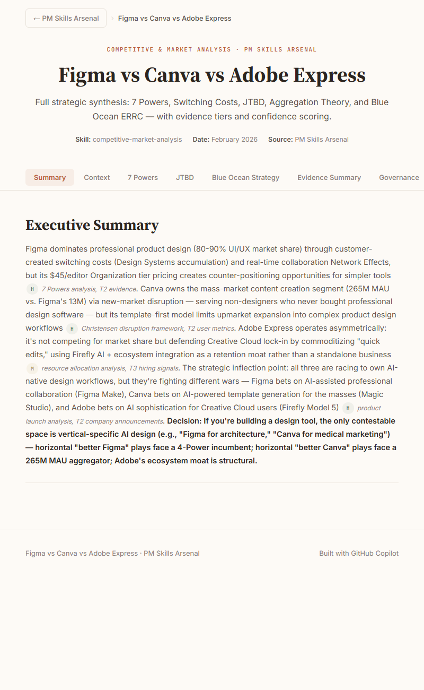
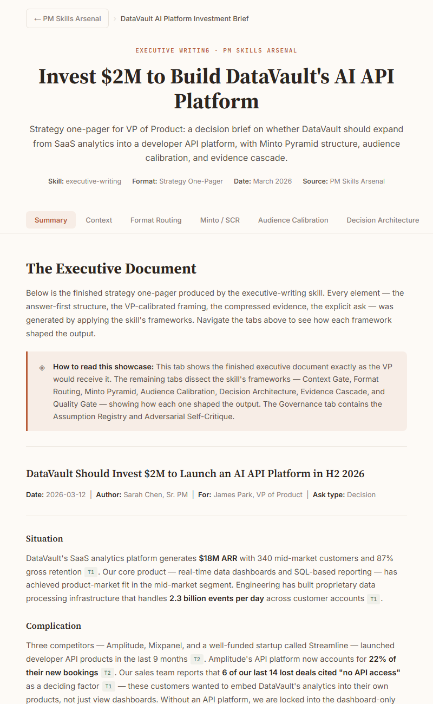
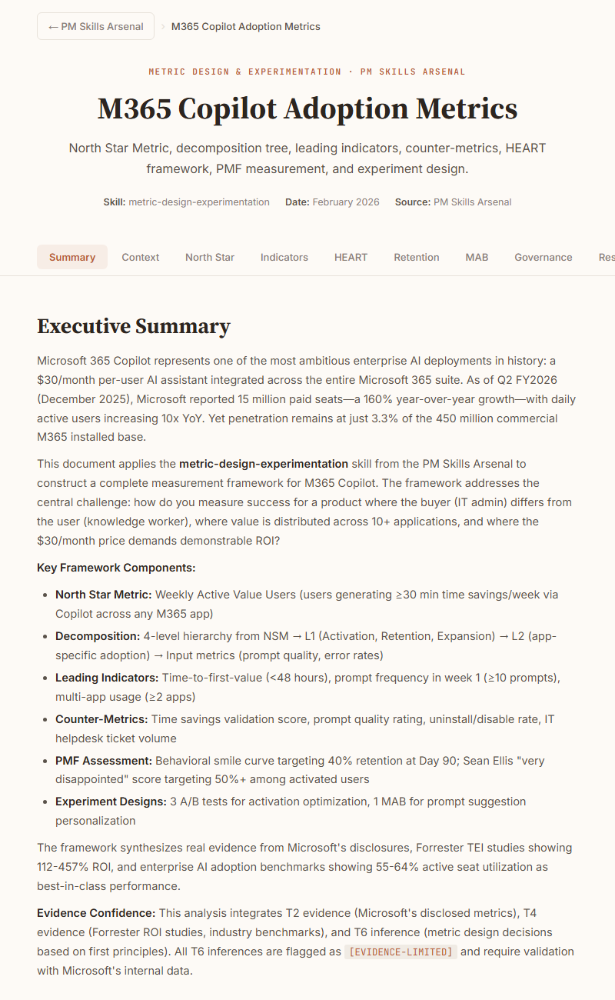
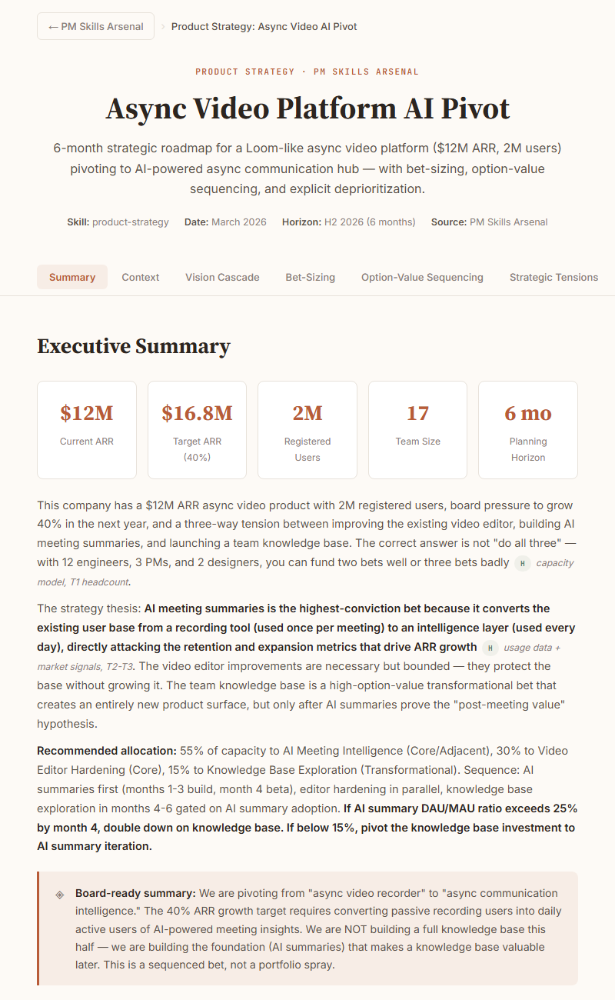

# PM Skills Arsenal

12 AI skill files that produce PM artifacts you cannot create unaided. Each is 1,000+ lines of encoded domain knowledge.

**[Live site with interactive showcases →](https://avyayalaya.github.io/pm-skills-arsenal)**

## Install

```bash
claude plugin marketplace add avyayalaya/pm-skills-arsenal
claude plugin install pm-skills@avyayalaya
```

Any AI tool works — paste the SKILL.md into ChatGPT, Cursor, Copilot, or Gemini.

## Benchmark

| Condition | Score |
|---|---|
| Baseline (Claude, no skill) | 47 / 105 |
| Anthropic's PM Skill | 81 / 105 |
| **PM Skills Arsenal** | **98 / 105** |

5 prompts × 7 dimensions × 3 conditions. [Full methodology and all 15 raw outputs →](benchmark/)

## Output

<table>
<tr>
<td align="center"><a href="https://avyayalaya.github.io/pm-skills-arsenal/showcase/articles/use-case-figma-canva-express.html"></a><br><strong>Competitive & Market Analysis</strong></td>
<td align="center"><a href="https://avyayalaya.github.io/pm-skills-arsenal/showcase/articles/use-case-executive-writing.html"></a><br><strong>Executive Writing</strong></td>
</tr>
<tr>
<td align="center"><a href="https://avyayalaya.github.io/pm-skills-arsenal/showcase/articles/use-case-metric-design.html"></a><br><strong>Metric Design & Experimentation</strong></td>
<td align="center"><a href="https://avyayalaya.github.io/pm-skills-arsenal/showcase/articles/use-case-product-strategy.html"></a><br><strong>Product Strategy</strong></td>
</tr>
</table>

[All 12 interactive showcases →](https://avyayalaya.github.io/pm-skills-arsenal/docs/use-cases.html)

## Skills

### Analysis & Research

- [**Competitive & Market Analysis**](skills/competitive-market-analysis/SKILL.md) — moat scoring, positioning maps, competitive response strategy
- [**Discovery & Research**](skills/discovery-research/SKILL.md) — evidence-graded synthesis with signal classification
- [**Problem Framing**](skills/problem-framing/SKILL.md) — structured problem definition with opportunity sizing

### Definition & Measurement

- [**Specification Writing**](skills/specification-writing/SKILL.md) — zero-question specs that executors start without clarification
- [**Metric Design & Experimentation**](skills/metric-design-experimentation/SKILL.md) — metric trees, experiment design, gaming countermeasures

### Strategy & Planning

- [**Product Strategy**](skills/product-strategy/SKILL.md) — roadmaps with confidence-rated bets and explicit deprioritization
- [**Go-to-Market Strategy**](skills/go-to-market-strategy/SKILL.md) — wedge identification, channel economics, launch gating
- [**Pricing & Packaging**](skills/pricing-packaging/SKILL.md) — model selection, willingness-to-pay, sensitivity analysis

### Communication & Influence

- [**Executive Writing**](skills/executive-writing/SKILL.md) — strategy one-pagers, board memos, decision briefs
- [**Narrative Building**](skills/narrative-building/SKILL.md) — positioning narratives with audience adaptation
- [**Multi-Channel Publishing**](skills/multi-channel-publishing/SKILL.md) — LinkedIn posts, conference abstracts, spoken scripts from long-form
- [**Stakeholder Alignment**](skills/stakeholder-alignment/SKILL.md) — influence mapping, coalition building, sequenced alignment

## Contributing

High bar. New skills must score ≥90/105 on the [benchmark](benchmark/). PRs improving existing skills welcome without the full benchmark.

---

MIT — [Parth Sangani](https://github.com/avyayalaya)
