# PM Skills Arsenal

> *AI produces polished analysis that changes no decisions. These skills fix that.*

12 PM skills — 1,000–1,300 lines each — for senior PMs, founders, AI engineers, and the agents that route between them.

### Quality benchmark (self-administered — read with that lens)

| Condition | Score |
|---|---|
| Baseline (Claude, no skill) | 47 / 105 |
| Anthropic's PM Skill | 81 / 105 |
| **PM Skills Arsenal** | **98 / 105** |

5 prompts × 7 dimensions × 3 conditions. **The same author wrote the rubric AND scored every output** — this is the author's own assessment, not an independent evaluation. The full methodology, the 7-dimension rubric, and all 15 raw outputs are published at [`benchmark/`](benchmark/) so you can re-score them yourself. If you do and reach a different conclusion, [open an issue](https://github.com/Avyayalaya/pm-skills-arsenal/issues) — independent verification beats author-administered scores every time.

[Live site with interactive showcases →](showcase/) · [Machine-readable manifest (AGENTS.md) →](AGENTS.md)

<table>
<tr>
<td align="center"><a href="showcase/articles/use-case-figma-canva-express.html">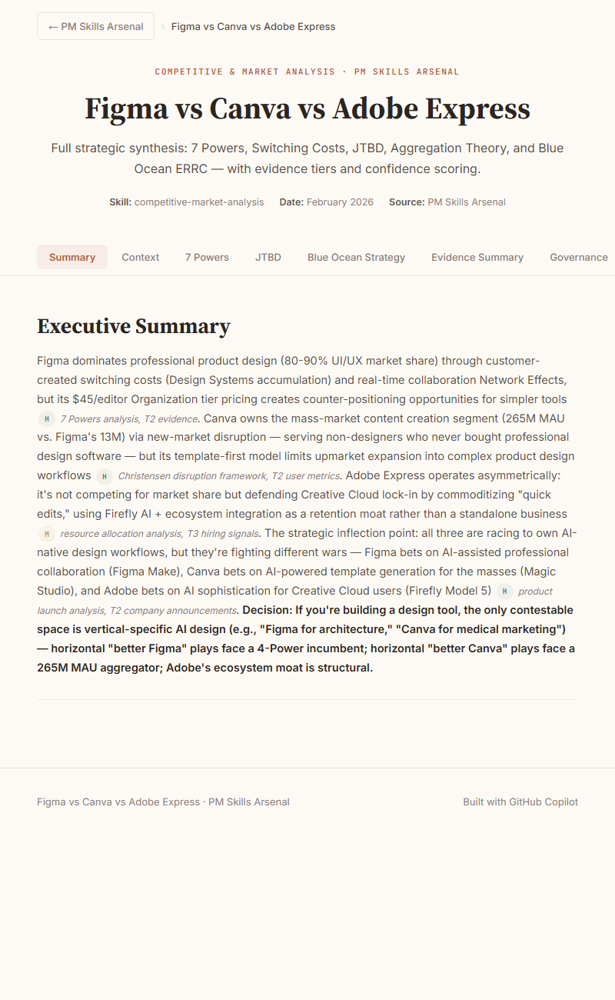</a><br><strong>Competitive & Market Analysis</strong></td>
<td align="center"><a href="showcase/articles/use-case-executive-writing.html">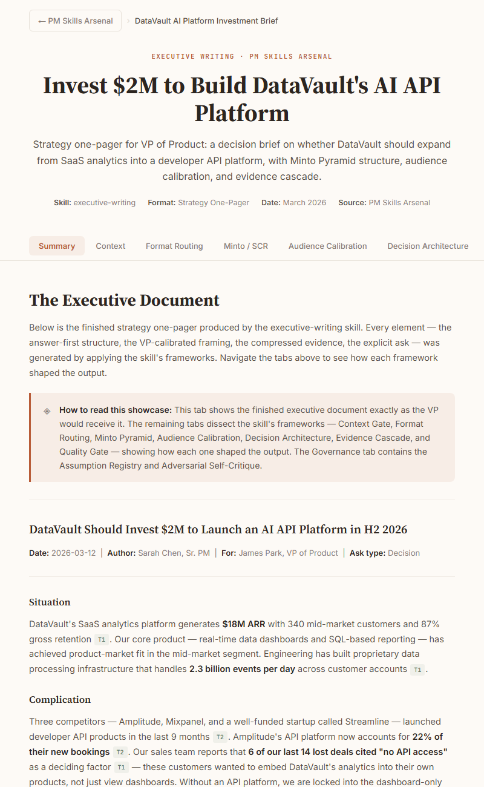</a><br><strong>Executive Writing</strong></td>
</tr>
<tr>
<td align="center"><a href="showcase/articles/use-case-metric-design.html">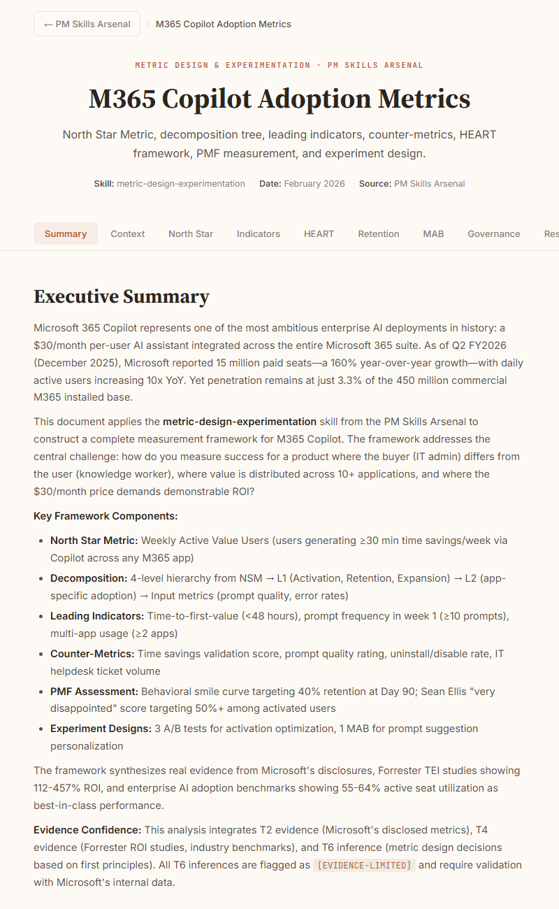</a><br><strong>Metric Design & Experimentation</strong></td>
<td align="center"><a href="showcase/articles/use-case-product-strategy.html">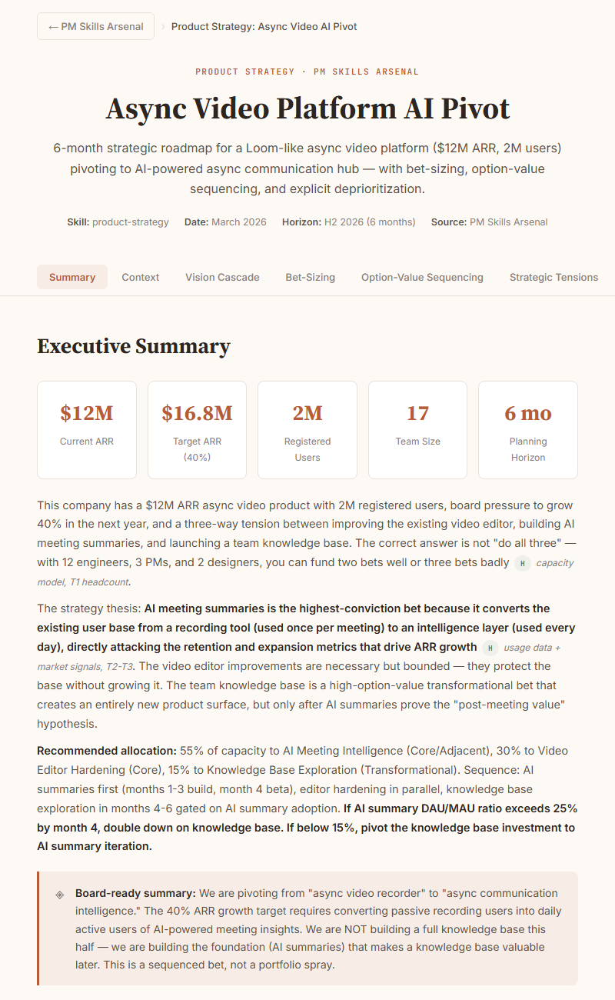</a><br><strong>Product Strategy</strong></td>
</tr>
</table>

## Install

### Via APM (recommended — one install, every harness)

[APM](https://github.com/microsoft/apm) — the Agent Package Manager — is a multi-harness manifest. One command configures the plugin across GitHub Copilot CLI, Claude Code, Cursor, OpenCode, Codex, and Gemini from a single `apm.yml`.

```bash
# pin to the released version for reproducibility
apm install Avyayalaya/pm-skills-arsenal#v2.1.0

# or floating on main (will warn about unpinned dependency)
apm install Avyayalaya/pm-skills-arsenal
```

The install brings the 12 PM skills, the `pm-skills` MCP server, and lifecycle telemetry hooks. Skills auto-register with each compatible harness.

> **First-time setup tip.** APM auto-detects your harness from directory markers (`.claude/`, `CLAUDE.md`, `.cursor/`, `.github/copilot-instructions.md`, `.codex/`, `.gemini/`, etc.). In a fresh project with no markers yet, pass `--target` explicitly:
>
> ```bash
> apm install Avyayalaya/pm-skills-arsenal#v2.1.0 --target claude
> # or: --target copilot, cursor, codex, gemini, opencode, windsurf
> ```
>
> Run `apm targets` to see the full list of supported harnesses.

### Via awesome-copilot marketplace (curated as of 2026-05-20)

`github/awesome-copilot` — the canonical APM aggregator marketplace — accepted this package into its `plugins/external.json` on 2026-05-20. If you already have that marketplace registered, install via:

```bash
apm marketplace add github/awesome-copilot   # first time only
apm install pm-skills@awesome-copilot
```

Same source repo (this one), same release ref (`v2.1.0`). Useful when `awesome-copilot` is already your team's go-to APM index.

### Direct (per-harness fallback)

**Claude Code:**

```bash
claude plugin marketplace add Avyayalaya/pm-skills-arsenal
claude plugin install pm-skills
```

**GitHub Copilot (Agency marketplace):**

Skills are listed in the Agency marketplace. Full setup: [GitHub Copilot Installation](docs/github-copilot-install.md).

**MCP server (Claude Desktop, Cursor, Cline, custom agents):**

```json
{
  "mcpServers": {
    "pm-skills": {
      "command": "python",
      "args": ["<absolute-path>/pm-skills-arsenal/mcp/pm_skills_mcp_server.py"]
    }
  }
}
```

Five tools: `list_skills`, `get_skill`, `list_agents`, `get_benchmark`, `run_skill`. [MCP setup →](mcp/README.md)

**Any other LLM (ChatGPT, Gemini, etc.):**

Copy the relevant `SKILL.md` into your context window. Each is self-contained.

## Built for agents

This system is designed to be discovered, evaluated, and routed by other AI agents — not just read by humans.

**[AGENTS.md](AGENTS.md)** — a machine-readable capability manifest at the repo root. Lists every skill, its frameworks, line count, version, and benchmark score. An orchestrator can decide whether to load a skill without reading 1,300 lines first.

**Per-skill YAML signals.** Every `SKILL.md` declares typed `capability_summary`, `input_schema`, and `output_schema` in its frontmatter. Routing is structural: an orchestrator reads the schemas, decides if the skill applies, then loads the body only if needed.

**MCP server** — `mcp/pm_skills_mcp_server.py` exposes five tools (`list_skills`, `get_skill`, `list_agents`, `get_benchmark`, `run_skill`) over the Model Context Protocol. Works with any MCP host: Claude Desktop, Cursor, Cline, custom agents. [Setup →](mcp/README.md)

**Plugin marketplaces:**
- APM (multi-harness, recommended): `apm install Avyayalaya/pm-skills-arsenal`
- Claude Code direct: `claude plugin marketplace add Avyayalaya/pm-skills-arsenal`
- Agency marketplace (Microsoft Copilot): listed in `agency-microsoft/playground`

**Invoke from a custom agent (Anthropic SDK):**

```python
from pathlib import Path
import anthropic

skill_path = Path("skills/competitive-market-analysis/SKILL.md")
skill = skill_path.read_text()

client = anthropic.Anthropic()
response = client.messages.create(
    model="claude-opus-4-7",
    max_tokens=8000,
    system=skill,  # the skill becomes the system prompt
    messages=[{"role": "user", "content": "Analyze Figma's position post-Adobe..."}],
)
```

The skill content is self-contained — no fine-tuning, no embeddings, no vector DB.

## Skills

### Analysis & Research

#### Competitive & Market Analysis

Decides who wins a market, why their advantage holds, and what to do about it.

**What you get:** Executive summary · moat scorecard · positioning map · scenario tree · recommendation. 2,000–5,000 words. Evidence-tiered (H/M/L), with adversarial self-critique surfacing ≥3 genuine weaknesses in the analysis itself.

**The methodology behind it:** 1,300 lines encoding 9 frameworks — 7 Powers (scores advantages by structural durability), Aggregation Theory (locates the user-facing layer that captures the value), Christensen Disruption (separates sustaining from disruptive threats), Wardley Mapping (positions each component on the build-buy-rent commodity gradient).

**Use when:** market entry, competitive response, moat assessment, build/buy/partner.
**Don't use for:** pure feature parity comparisons (use specification-writing).

[Showcase →](showcase/articles/use-case-figma-canva-express.html) · [SKILL.md →](skills/competitive-market-analysis/SKILL.md)

#### Discovery Research

Synthesizes raw research inputs into findings a PM can act on, with explicit confidence levels and named evidence gaps.

**What you get:** Source inventory · key findings · validated-vs-hypothesis split · contradiction analysis · evidence-gap list · recommendations. 2,000–4,000 words. Every finding carries an evidence tier (H/M/L) and source triangulation; weak claims are flagged as hypotheses, not insights.

**The methodology behind it:** 1,100 lines encoding 8 frameworks — evidence synthesis (grades each claim by source quality and triangulation), interview analysis (extracts patterns across qualitative transcripts), hypothesis building (separates what evidence proves from what it merely suggests).

**Use when:** synthesizing interview rounds, evaluating whether evidence is decision-ready, resolving conflicting signals across surveys/interviews/behavioral data.
**Don't use for:** designing the research itself (use problem-framing to identify what to investigate).

[Showcase →](showcase/articles/use-case-discovery-research.html) · [SKILL.md →](skills/discovery-research/SKILL.md)

#### Problem Framing

Decomposes a vague problem area into an evidence-graded statement, sized opportunity, and prioritized sub-problems before discovery or specs begin.

**What you get:** Problem statement · root-cause analysis · opportunity sizing · stakeholder impact matrix · constraint map · ICE/RICE-scored sub-problems · recommendations. 1,500–3,500 words. Surfaces hidden assumptions and explicitly separates the problem you were handed from the problem actually worth solving.

**The methodology behind it:** 1,100 lines encoding 8 frameworks — Problem Definition Canvas (forces who/what/why/evidence onto one page), 5 Whys (drills past the symptom to the structural cause), ICE/RICE (ranks sub-problems by impact, confidence, and effort).

**Use when:** stakeholder hands you a solution disguised as a problem, multiple teams disagree on what's broken, prioritizing across competing problem areas, scoping a new initiative.
**Don't use for:** detailed solution design once the problem is clear (use specification-writing).

[Showcase →](showcase/articles/use-case-problem-framing.html) · [SKILL.md →](skills/problem-framing/SKILL.md)

### Definition & Measurement

#### Specification Writing

Closes the gap between rough feature intent and a spec an executor can begin without asking a single clarifying question.

**What you get:** Outcome definition · scope with explicit out-of-scope boundaries · binary-testable acceptance criteria · dependency and TBD register · failure conditions · assumption registry · zero-question completeness score. 2,000–4,500 words. Routes between 6 spec types (product, API, agent, workflow, infra, research) and tags each requirement with confidence.

**The methodology behind it:** 1,100 lines encoding 6 frameworks — outcome-first methodology (forces success criteria before scope), acceptance criteria taxonomy (rejects untestable language), scope boundary protocol (every excluded capability is named, not assumed away).

**Use when:** product or feature specs, API contracts, agent task specs, infrastructure migrations.
**Don't use for:** problem definition before the spec exists (use problem-framing).

[Showcase →](showcase/articles/use-case-specification.html) · [SKILL.md →](skills/specification-writing/SKILL.md)

#### Metric Design & Experimentation

Builds a measurement framework that detects problems early, resists gaming, and validates causality before the dashboard ships.

**What you get:** Metric hierarchy (North Star → L1 → L2 → input) · counter-metric pairs · leading/lagging indicators with temporal lag · A/B plan with power and decision rules · retention cohort design · intervention triggers. 2,500–5,000 words. Quality gates check for proxy divergence, Goodhart drift, and Simpson's paradox before sign-off.

**The methodology behind it:** 1,300 lines encoding 9 frameworks — NSM rubrics (selects a North Star that won't be gamed), Goodhart countermeasures (pairs every primary metric with a guardrail that breaks if the primary is gamed), retention cohort design (separates real PMF erosion from denominator artifacts).

**Use when:** new-launch measurement, A/B design, suspected metric gaming, building a team metric tree.
**Don't use for:** SaaS finance metric formulas (use a finance reference).

[Showcase →](showcase/articles/use-case-metric-design.html) · [SKILL.md →](skills/metric-design-experimentation/SKILL.md)

### Strategy & Planning

#### Product Strategy

Sequences strategic bets so a team knows what to build, in what order, why, and what they're explicitly not doing.

**What you get:** Falsifiable vision · confidence-rated strategic bets with hypotheses · sequencing rationale with counterfactuals · NOT-doing list with named opportunity costs · resource plan against capacity · strategic-tension map · quarterly gates with kill criteria. 2,500–4,500 words. The deprioritization section is mandatory — every strategy makes its rejected paths visible.

**The methodology behind it:** 1,100 lines encoding 7 frameworks — Bet-Sizing (matches investment to confidence), Option-Value Sequencing (orders bets so early ones expand later choices), Tension Surfacing (names where bets compete for the same resource and how it gets resolved).

**Use when:** quarterly or annual planning, portfolio allocation, strategy reviews.
**Don't use for:** writing the spec for a single bet once chosen (use specification-writing).

[Showcase →](showcase/articles/use-case-product-strategy.html) · [SKILL.md →](skills/product-strategy/SKILL.md)

#### Go-to-Market Strategy

Maps how a product wins its first customers and compounds from there — wedge, segment, channel, launch sequence.

**What you get:** Market entry thesis · ICP-scored segment selection · channel strategy with unit economics per channel · phased launch plan with gates and kill criteria · positioning and battlecards · success and failure metrics. 2,500–5,000 words. Every segment and channel claim is evidence-tiered; launch phases carry explicit kill conditions, not just go-criteria.

**The methodology behind it:** 1,200 lines encoding 7 frameworks — Market Entry Thesis (states why this market and why now in falsifiable form), Channel Unit Economics (rejects channels whose CAC math doesn't close), Launch Gating (defines what blocks the next phase, not just what triggers it).

**Use when:** new market entry, feature launch, GTM motion pivot, launch-readiness review.
**Don't use for:** pricing-only decisions (use pricing-packaging).

[Showcase →](showcase/articles/use-case-go-to-market-strategy.html) · [SKILL.md →](skills/go-to-market-strategy/SKILL.md)

#### Pricing & Packaging

Tests what to charge, why, and what breaks if you're wrong before the new price hits the website.

**What you get:** Model selection · willingness-to-pay range with evidence flags · competitive price-value map · Good/Better/Best package architecture · sensitivity analysis at ±10/20/30% · rollout and grandfathering plan. 2,000–4,500 words. Sensitivity analysis is mandatory; every WTP range is tagged with the evidence quality behind it (customer data vs. analyst estimate vs. hypothesis).

**The methodology behind it:** 1,200 lines encoding 7 frameworks — Model Selection (routes between subscription, usage, hybrid, and freemium based on cost structure), Van Westendorp (anchors WTP from four price-perception questions), Good/Better/Best (allocates features to drive tier conversion rather than feature count).

**Use when:** new product pricing, packaging redesign, price change impact, usage-based AI pricing.
**Don't use for:** full GTM strategy (use go-to-market-strategy).

[Showcase →](showcase/articles/use-case-pricing-packaging.html) · [SKILL.md →](skills/pricing-packaging/SKILL.md)

### Communication & Influence

#### Executive Writing

Compresses a full analysis into a document a VP can read once and act on without a guided walkthrough.

**What you get:** A formatted strategy one-pager, board memo, or decision brief — chosen by routing on context · audience-calibration notes · the explicit ask, extracted · executive readability quality check. 800–2,500 words. Decision asks surface in the first paragraph rather than under context, and jargon is stripped before the document ships.

**The methodology behind it:** 1,200 lines encoding 8 frameworks — Minto/SCR (puts the answer first, then the supporting argument), Audience Calibration (adjusts framing by executive role — CFO, CRO, CEO, board chair), Decision Architecture (forces an explicit ask with the options the reader must choose between).

**Use when:** board memos, exec review docs, decision briefs, investment memos, strategy one-pagers.
**Don't use for:** working-level engineering specs (use specification-writing).

[Showcase →](showcase/articles/use-case-executive-writing.html) · [SKILL.md →](skills/executive-writing/SKILL.md)

#### Narrative Building

Constructs the story that makes a product or strategy feel inevitable — not by assertion, but by structural argument.

**What you get:** Executive narrative (≤7 sentences, VP-ready) · arc spine · Dunford-style positioning · Why Now analysis · per-audience variants · evidence-mapped claims · objection playbook · pre-launch testing protocol. 2,000–4,500 words. Every claim links to evidence, every objection has a steel-manned response, and variants surface where the story bends for different rooms.

**The methodology behind it:** 1,200 lines encoding 8 frameworks — Narrative Arc Construction (builds tension → shift → opportunity → role → proof → call), Dunford Positioning (defines the alternatives the customer is choosing between), Why Now (forces a temporal argument backed by evidence, not vibes).

**Use when:** product launches, repositioning, investor pitches, internal alignment, analyst briefings.
**Don't use for:** the underlying competitive analysis (use competitive-market-analysis first).

[Showcase →](showcase/articles/use-case-narrative-building.html) · [SKILL.md →](skills/narrative-building/SKILL.md)

#### Multi-Channel Publishing

Derives channel-ready content from a long-form source — LinkedIn post, conference abstract, podcast brief, spoken script, newsletter — without losing the thesis.

**What you get:** The formatted derivative · compression log tracing kept and cut elements back to source · thesis fidelity check · per-dimension quality verdict. 500–2,500 words depending on channel. The compression log is mandatory: nothing gets dropped silently, and the derivative reads native to the channel rather than as a chopped article.

**The methodology behind it:** 1,100 lines encoding 7 frameworks — Channel Taxonomy (maps format rules and evidence density per channel), 7-Step Compression (rebuilds rather than truncates), Hook Adaptation (rewrites the opening to match how each channel surfaces content in its feed).

**Use when:** repurposing a Substack into LinkedIn, deriving a conference abstract, building a launch distribution package.
**Don't use for:** writing the long-form source itself.

[Showcase →](showcase/articles/use-case-multi-channel-publishing.html) · [SKILL.md →](skills/multi-channel-publishing/SKILL.md)

#### Stakeholder Alignment

Diagnoses why a multi-stakeholder decision is stuck and sequences the moves that get it unstuck.

**What you get:** Power-Interest-Position matrix · coalition analysis (allies, opponents, swing voters, power brokers) · decision archaeology · ordered alignment plan · per-stakeholder communication strategy (framing, format, messenger) · objection playbook with steel-manned responses. 2,000–4,000 words. The plan is sequenced — who to align first, who to align last, and which conversations cannot happen until others land.

**The methodology behind it:** 1,200 lines encoding 7 frameworks — Power-Interest-Position (maps formal authority and informal influence), Decision Archaeology (uncovers the historical and incentive structures behind a stakeholder's current position), Alignment Sequencing (orders conversations to build coalition momentum rather than burn it).

**Use when:** 3+ stakeholders with different interests, executive sponsorship, diagnosing silent resistance, inheriting a politically complex project.
**Don't use for:** RACI assignment (build a RACI directly).

[Showcase →](showcase/articles/use-case-stakeholder-alignment.html) · [SKILL.md →](skills/stakeholder-alignment/SKILL.md)

## Output examples

Each thumbnail links to an interactive showcase: full skill output with tabbed navigation, evidence tiers, and framework analysis.

<table>
<tr>
<td align="center"><a href="showcase/articles/use-case-figma-canva-express.html"></a><br><strong>Competitive & Market Analysis</strong></td>
<td align="center"><a href="showcase/articles/use-case-discovery-research.html">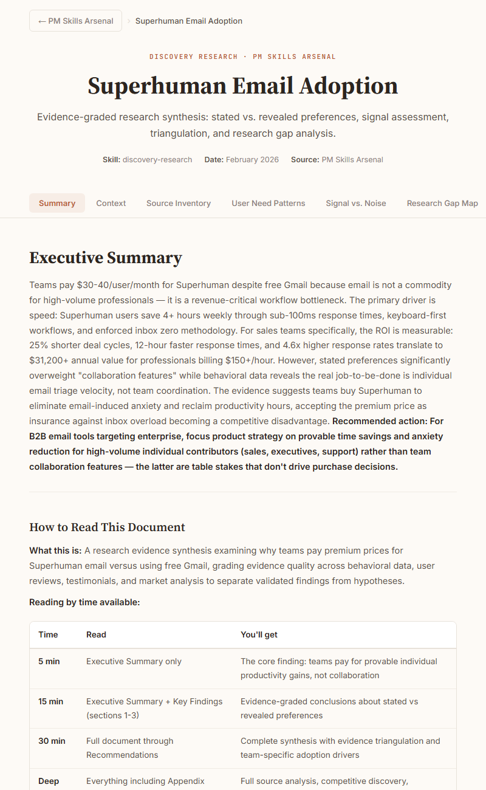</a><br><strong>Discovery Research</strong></td>
<td align="center"><a href="showcase/articles/use-case-problem-framing.html">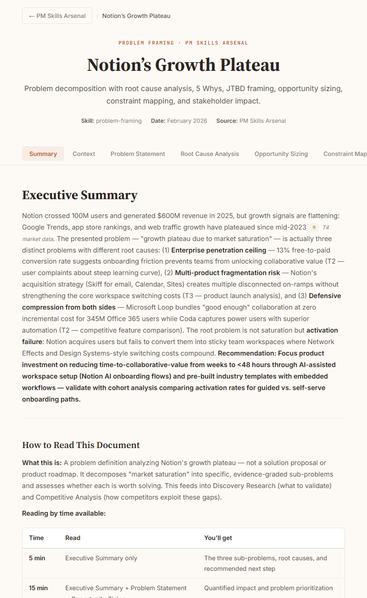</a><br><strong>Problem Framing</strong></td>
<td align="center"><a href="showcase/articles/use-case-specification.html">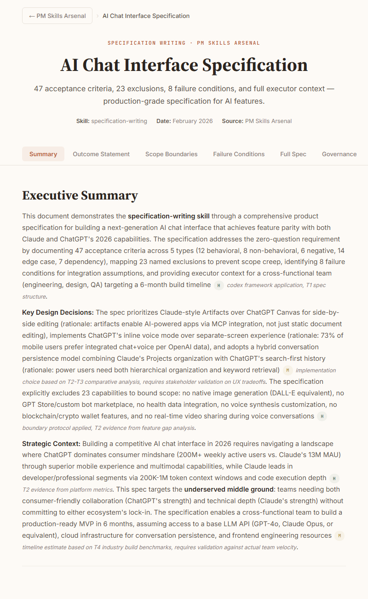</a><br><strong>Specification Writing</strong></td>
</tr>
<tr>
<td align="center"><a href="showcase/articles/use-case-metric-design.html"></a><br><strong>Metric Design & Experimentation</strong></td>
<td align="center"><a href="showcase/articles/use-case-product-strategy.html"></a><br><strong>Product Strategy</strong></td>
<td align="center"><a href="showcase/articles/use-case-go-to-market-strategy.html">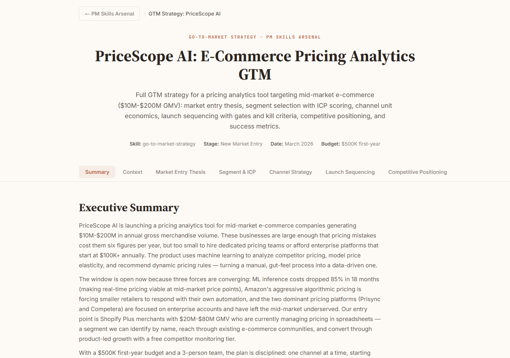</a><br><strong>Go-to-Market Strategy</strong></td>
<td align="center"><a href="showcase/articles/use-case-pricing-packaging.html">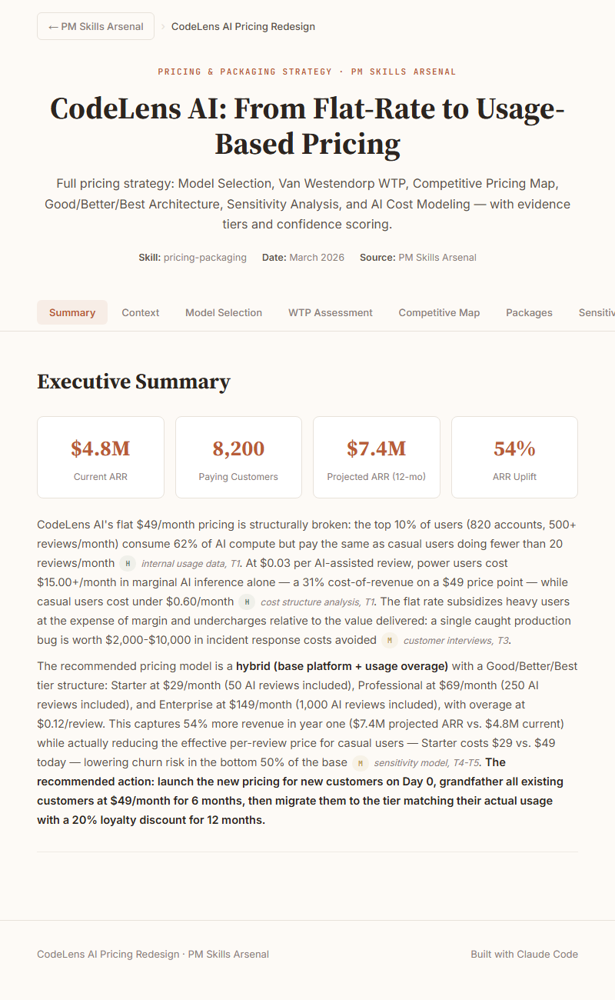</a><br><strong>Pricing & Packaging</strong></td>
</tr>
<tr>
<td align="center"><a href="showcase/articles/use-case-executive-writing.html"></a><br><strong>Executive Writing</strong></td>
<td align="center"><a href="showcase/articles/use-case-narrative-building.html">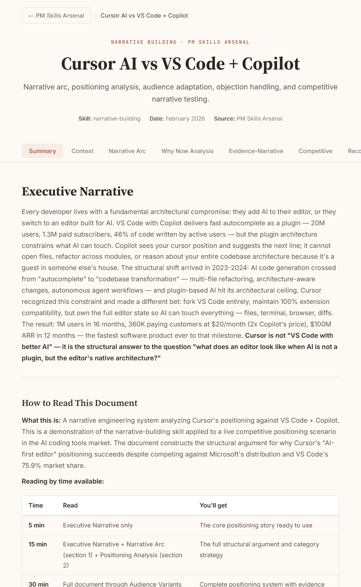</a><br><strong>Narrative Building</strong></td>
<td align="center"><a href="showcase/articles/use-case-multi-channel-publishing.html">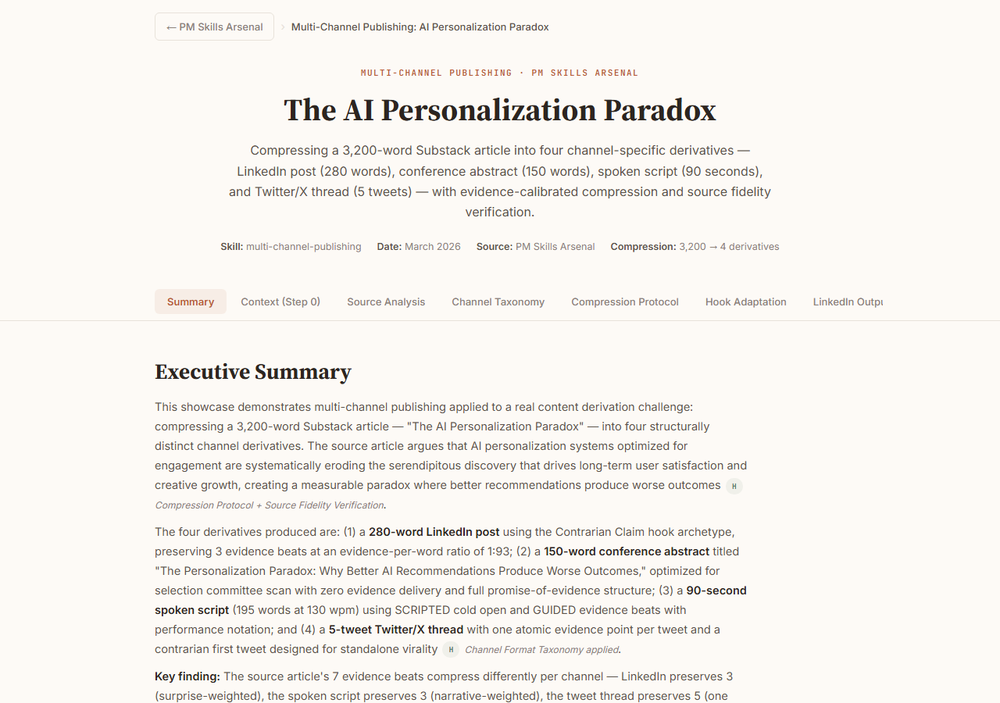</a><br><strong>Multi-Channel Publishing</strong></td>
<td align="center"><a href="showcase/articles/use-case-stakeholder-alignment.html">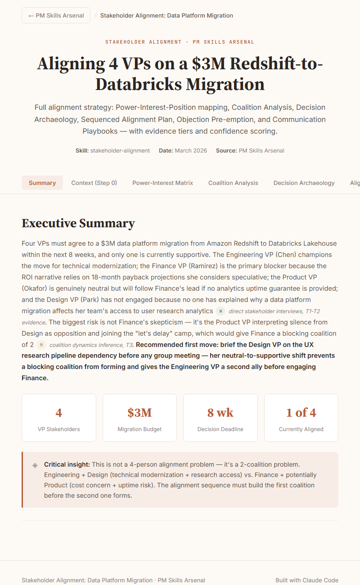</a><br><strong>Stakeholder Alignment</strong></td>
</tr>
</table>

[All 12 interactive showcases →](docs/use-cases.md)

## Who this is for

**For senior PMs.** You ship analysis that has to survive an executive review or a board meeting. These skills compress framework-grade methodology into a single load. Same model, same prompt, but the output now has structural moat scoring, evidence tiers, and adversarial self-critique by default.

**For founders.** You don't have a CPO. You need pricing analysis a board chair will respect, GTM logic a VC will read past slide 3, and metric trees that survive contact with reality. Pick the skill, paste it into the LLM you already use, get the artifact.

**For AI engineers building agentic systems.** Each skill ships with typed input/output schemas (`capability_summary`, `input_schema`, `output_schema`). Compose them into pipelines. Route between them with an orchestrator. Five MCP tools wrap the catalog for any MCP host.

**For AI agents and orchestrators.** [AGENTS.md](AGENTS.md) is the entry point. Per-skill YAML schemas decide routability. The MCP server (`mcp/`) exposes the catalog as tools. The plugin marketplaces (Claude Code, Agency) make installation a one-liner. The system is built to be discovered structurally, not crawled.

## Quality bar

**Benchmark.** 5 prompts (each from a real-world PM scenario) × 7 quality dimensions (framework application, evidence quality, decision orientation, structural rigor, calibration, defensibility, voice) × 3 conditions (baseline, Anthropic's PM skill, this arsenal). 15 raw outputs in [`benchmark/`](benchmark/). Score is the LLM-as-judge total against the rubric in `benchmark/rubric.md`.

**Contribution standard.** New skills must score ≥90/105 on the same rubric to land on `main`. PRs improving existing skills go to a milestone branch and re-benchmark before merge.

**Audit.** `validate_skills.py` checks every `SKILL.md` for `capability_summary`, `input_schema`, `output_schema`, and `example_invocation` in the YAML frontmatter. Run before any release.

---

[Live site](showcase/) · [Benchmark](benchmark/) · [Contribute](CONTRIBUTING.md) · MIT · [Parth Sangani](https://github.com/Avyayalaya)
